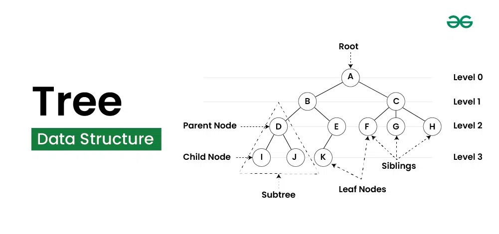

# Tree Data Structure

A **Tree** is a hierarchical, non-linear data structure consisting of nodes connected by edges. It is widely used in computer science for organizing and storing data in a structured way.

  
*Image Source: [GeeksforGeeks](https://www.geeksforgeeks.org/tree-data-structure/)*

---

## **Tree Data Structure Usage**
Trees are used in various real-world and computational scenarios:
- **File Explorer**: Represents the directory structure of a file system.
- **Databases**: Implements indexes (e.g., B-Trees) for efficient querying.
- **DNS**: Hierarchical domain name resolution.
- **HTML DOM**: Represents the structure of an HTML document.

---

## **Tree Components**
1. **Root**:
   - The topmost node of the tree.
   - It has no incoming edges but may have one or more outgoing edges.

2. **Leaf Node**:
   - Nodes at the bottom of the tree.
   - They have no outgoing edges but may have an incoming edge.
   - Example: Endpoints of a file directory.

3. **Branch Node**:
   - Nodes in the middle of the tree.
   - They have both incoming and outgoing edges.

4. **Parent Node**:
   - A node with outgoing edges to its children.
   - Example: A folder containing subfolders or files.

5. **Child Node**:
   - A node with an incoming edge from a parent node.
   - Example: A subfolder or file in a directory.

   > **Note**: A node can be both a parent and a child, such as branch nodes.

6. **Siblings**:
   - Nodes that share the same parent.
   - Example: Files in the same directory.

7. **Cousins**:
   - Nodes that are at the same depth but have different parent nodes.
   - Example: Subdirectories in different parent folders at the same level.

8. **Subtree**:
   - A smaller tree that is part of a larger tree.
   - Each child of the root can be considered the root of its subtree.

---

## **Tree Properties**

1. **Size**:
   - Defined as the total number of nodes in the tree.
   - Formula: `size = number of nodes`.

2. **Depth**:
   - The number of edges from the root node to a given node.
   - Represents how "deep" a node is within the tree.

3. **Height**:
   - The number of edges on the longest path from the root node to a leaf node.
   - Represents the "tallness" of the tree.

---

## **Key Terminology Recap**
| **Term**         | **Description**                                     |
|------------------|-----------------------------------------------------|
| Root             | The topmost node with no incoming edges.            |
| Leaf Node        | A node with no outgoing edges.                      |
| Branch Node      | A node with both incoming and outgoing edges.       |
| Parent Node      | A node with children (outgoing edges).              |
| Child Node       | A node connected to a parent (incoming edges).      |
| Siblings         | Nodes sharing the same parent.                      |
| Cousins          | Nodes at the same depth but with different parents. |
| Subtree          | A tree contained within another tree.               |
| Size             | Total number of nodes in the tree.                  |
| Depth            | Number of edges below the root to a specific node.  |
| Height           | Number of edges above the farthest leaf node.       |

---

## Binary Search Tree (BST)
- A specialized form of a tree where:
   1. The left subtree contains values smaller than the parent node.
   2. The right subtree contains values larger than the parent node.

[See more](./binarySearchTree/BINARYSEARCHTREE.md)

---

Trees are foundational to many algorithms and data structures. Learning their properties and usage is essential for solving complex problems efficiently.