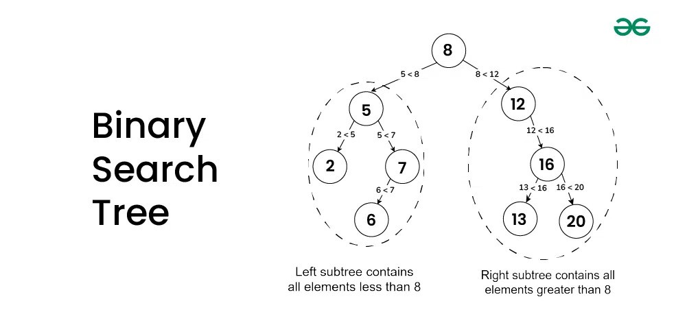

# Binary Search Tree (BST)

A **Binary Search Tree (BST)** is a specialized binary tree data structure that maintains sorted data in a hierarchical format. It allows efficient searching, insertion, and deletion operations.

---

## **What is a Binary Search Tree?**


*Image Source: [GeeksforGeeks](https://www.geeksforgeeks.org/introduction-to-binary-search-tree/)*

- **Binary Tree**: A tree where each node has at most two child nodes (left and right).
- **Binary Search Tree**: A binary tree with the following properties:
    1. The left subtree contains nodes with values **less than** the parent node.
    2. The right subtree contains nodes with values **greater than** the parent node.
    3. Both the left and right subtrees must also be binary search trees.

---

## **Key Features**
- **Hierarchical Structure**: Organizes data in levels, starting from the root.
- **Efficient Operations**:
    - Searching, insertion, and deletion are efficient with average-case time complexity of `O(log n)`.
    - Worst-case time complexity is `O(n)` when the tree becomes skewed (like a linked list).
- **Sorted Traversal**: In-order traversal of a BST yields elements in sorted order.

---

## **Big O Time Complexity**

| Operation | Best Case (`O`) | Average Case (`O`) | Worst Case (`O`) |
|-----------|-----------------|--------------------|------------------|
| Search    | `O(log n)`      | `O(log n)`         | `O(n)`           |
| Insert    | `O(log n)`      | `O(log n)`         | `O(n)`           |
| Delete    | `O(log n)`      | `O(log n)`         | `O(n)`           |

**Note**: The worst-case complexity occurs when the tree is unbalanced, resembling a linked list.

---

## **Components of a BST**
1. **Node**:
    - Stores a value (`data`) and references to its left and right child nodes.
2. **Root**:
    - The topmost node of the tree.
3. **Left Subtree**:
    - Contains nodes with values smaller than the parent node.
4. **Right Subtree**:
    - Contains nodes with values larger than the parent node.
5. **Leaf Node**:
    - A node with no children.

---

## **Operations on a BST**

1. **Insertion**:
    - Insert values by comparing with the root and traversing to the left or right child until the correct position is found.

2. **Search**:
    - Traverse the tree by comparing the value with the current node to check if the value exists.

3. **Deletion**:
    - Remove nodes while maintaining the BST properties:
        - **Case 1**: Node is a leaf (simply remove it).
        - **Case 2**: Node has one child (replace the node with its child).
        - **Case 3**: Node has two children (replace the node with its in-order successor or predecessor).

4. **Traversal**:
    - **In-Order Traversal**: Retrieves elements in ascending order.
    - **Pre-Order Traversal**: Visits the root before its subtrees.
    - **Post-Order Traversal**: Visits the subtrees before the root.

---

## Java Code

**Node Class**:
```java
public class Node {
    int data; // Value stored in the node
    Node left; // Left child reference
    Node right; // Right child reference

    public Node(int data) {
        this.data = data; // Initialize node with data
    }
}
```

**BinarySearchTree Class**:
```java
public class BinarySearchTree {

    Node root; // Root of the Binary Search Tree

    // Insert a node into the Binary Search Tree
    public void insert(Node node) {
        root = insertHelper(root, node);
    }

    // Recursive helper method for inserting a node
    private Node insertHelper(Node root, Node node) {
        int data = node.data;

        // If the current root is null, place the node here
        if (root == null) {
            root = node;
            return root;
        }
        // Traverse the left subtree for smaller values
        else if (data < root.data) {
            root.left = insertHelper(root.left, node);
        }
        // Traverse the right subtree for larger values
        else {
            root.right = insertHelper(root.right, node);
        }

        return root; // Return the updated root after insertion
    }

    // Display all nodes in ascending order
    public void display() {
        displayHelper(root);
    }

    // Recursive helper method to display the tree (in-order traversal)
    private void displayHelper(Node root) {
        if (root != null) {
            displayHelper(root.left); // Visit left subtree
            System.out.println(root.data); // Print the node's data
            displayHelper(root.right); // Visit right subtree
        }
    }

    // Search for a value in the Binary Search Tree
    public boolean search(int data) {
        return searchHelper(root, data);
    }

    // Recursive helper method for searching a value
    private boolean searchHelper(Node root, int data) {
        // If root is null, the value is not found
        if (root == null) {
            return false;
        }
        // If the current node's data matches, return true
        else if (root.data == data) {
            return true;
        }
        // Traverse the left subtree for smaller values
        else if (data < root.data) {
            return searchHelper(root.left, data);
        }
        // Traverse the right subtree for larger values
        else {
            return searchHelper(root.right, data);
        }
    }

    // Remove a node with the specified value
    public void remove(int data) {
        if (search(data)) { // Only attempt removal if the value exists
            root = removeHelper(root, data);
        } else {
            System.out.println(data + " could not be found!");
        }
    }

    // Recursive helper method for removing a node
    private Node removeHelper(Node root, int data) {
        // If root is null, nothing to remove
        if (root == null) {
            return root;
        }
        // Traverse left for smaller values
        else if (data < root.data) {
            root.left = removeHelper(root.left, data);
        }
        // Traverse right for larger values
        else if (data > root.data) {
            root.right = removeHelper(root.right, data);
        }
        // Node to be removed is found
        else {
            // Handle the case of a leaf node
            if (root.left == null && root.right == null) {
                root = null;
            }
            // Find the in-order successor if right subtree exists
            else if (root.right != null) {
                root.data = successor(root);
                root.right = removeHelper(root.right, root.data);
            }
            // Find the in-order predecessor if left subtree exists
            else {
                root.data = predecessor(root);
                root.left = removeHelper(root.left, root.data);
            }
        }

        return root; // Return the updated root after removal
    }

    // Find the smallest value in the right subtree
    private int successor(Node root) {
        root = root.right;
        while (root.left != null) {
            root = root.left;
        }
        return root.data;
    }

    // Find the largest value in the left subtree
    private int predecessor(Node root) {
        root = root.left;
        while (root.right != null) {
            root = root.right;
        }
        return root.data;
    }
}
```

**Code Example**:
```java
public class Main {
    
    public static void main(String[] args) {

        // Create an instance of BinarySearchTree
        BinarySearchTree tree = new BinarySearchTree();

        // Insert nodes into the BST
        System.out.println("Inserting nodes into the Binary Search Tree...");
        tree.insert(new Node(5));
        tree.insert(new Node(1));
        tree.insert(new Node(9));
        tree.insert(new Node(2));
        tree.insert(new Node(7));
        tree.insert(new Node(3));
        tree.insert(new Node(6));
        tree.insert(new Node(4));
        tree.insert(new Node(8));

        // Attempt to remove a non-existent value (0)
        System.out.println("\nAttempting to remove value 0 (non-existent)...");
        tree.remove(0);

        // Attempt to remove an existent value (1)
        System.out.println("\nAttempting to remove value 1...");
        tree.remove(1);

        // Display the BST in ascending order (in-order traversal)
        System.out.println("\nDisplaying the Binary Search Tree (In-Order Traversal):");
        tree.display();

        // Search for a value in the BST
        System.out.println("\nSearching for value 10 in the Binary Search Tree...");
        boolean isFound = tree.search(10);
        System.out.println("Is value 10 found? " + isFound);

        System.out.println("\nSearching for value 9 in the Binary Search Tree...");
        isFound = tree.search(9);
        System.out.println("Is value 9 found? " + isFound);
    }
}
```

**Output**:
```text
Inserting nodes into the Binary Search Tree...

Attempting to remove value 0 (non-existent)...
0 could not be found!

Attempting to remove value 1...

Displaying the Binary Search Tree (In-Order Traversal):
2
3
4
5
6
7
8
9

Searching for value 10 in the Binary Search Tree...
Is value 10 found? false

Searching for value 9 in the Binary Search Tree...
Is value 9 found? true
```